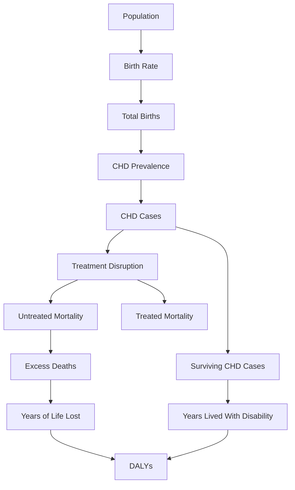

# Model Diagram

This diagram illustrates the structure of the congenital heart disease burden model.

The model estimates excess mortality and disability adjusted life years associated with disruption of pediatric cardiac care.

---

## Model Flow



---

## Model Description

The model estimates congenital heart disease burden using a deterministic population framework.

The calculation follows these stages.

1. Population and birth rate estimates are used to calculate total births during the study period.
2. Congenital heart disease prevalence is applied to estimate the number of affected births.
3. Treatment disruption is modeled by comparing untreated mortality and treated mortality.
4. Excess deaths are calculated from the difference between untreated and treated outcomes.
5. Years of life lost are calculated using life expectancy and mean age at death.
6. Survivors contribute to years lived with disability using a disability weight.
7. Total burden is calculated as disability adjusted life years.

---

## Key Output

The final output of the model is:

```
DALYs = Years of Life Lost + Years Lived With Disability
```

Where:

- Years of Life Lost represents premature mortality
- Years Lived With Disability represents non fatal health loss

---

## Purpose

This diagram provides a conceptual overview of the modeling pipeline implemented in `chd_burden_model.py`.
