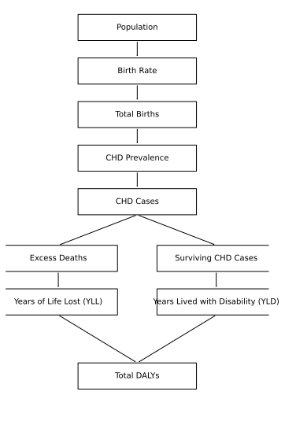

# Congenital Heart Disease Burden Model


Reproducible Python model estimating congenital heart disease mortality and disability-adjusted life years under disruption of pediatric cardiac care.

---

## Overview

Congenital heart disease (CHD) is the most common congenital anomaly worldwide, affecting approximately 9–10 per 1000 live births. Survival outcomes depend heavily on timely surgical and catheter-based intervention.

In settings where health systems are disrupted, access to pediatric cardiac care may be reduced or unavailable. Under these conditions, congenital heart disease can lead to increased preventable mortality and long-term disability.

This repository provides a transparent and reproducible population model estimating congenital heart disease burden under disrupted treatment scenarios.

The code serves as the computational implementation supporting the associated research analysis.

---

## Model Diagram



The model estimates disease burden by combining population demographics, CHD birth prevalence, treatment disruption scenarios, and Global Burden of Disease DALY methodology.

---

## Model Structure

The model follows a deterministic population framework consisting of the following steps.

1. Estimate births during the study period  
2. Estimate congenital heart disease incidence  
3. Estimate excess mortality associated with treatment disruption  
4. Calculate Years of Life Lost (YLL)  
5. Calculate Years Lived with Disability (YLD)  
6. Compute total Disability Adjusted Life Years (DALYs)

Sensitivity analysis evaluates uncertainty in untreated mortality assumptions.

---

## Repository Structure

```
.
├── chd_burden_model.py
├── generate_model_diagram.py
├── README.md
├── METHODS.md
├── MODEL_PARAMETERS.md
├── MODEL_DIAGRAM.md
├── requirements.txt
├── LICENSE
├── CITATION.cff
├── .gitignore
│
└── figures
    ├── model_structure.png
    └── model_structure.svg
```

### Key Files

**chd_burden_model.py**  
Main implementation of the congenital heart disease burden model.

**MODEL_PARAMETERS.md**  
Complete documentation of model parameters and assumptions.

**METHODS.md**  
Technical description of the modeling methodology.

**MODEL_DIAGRAM.md**  
Conceptual diagram explaining the modeling pipeline.

**generate_model_diagram.py**  
Script used to generate the model diagram figures.

---

## Running the Model

### Requirements

Python 3.8 or newer.

Install dependencies

```
pip install -r requirements.txt
```

### Run the model

```
python chd_burden_model.py
```

The script prints model outputs directly to the terminal in a format suitable for manuscript reporting.

---

## Example Output

```
Equation 1 (Births per year): 60900
Equation 2 (Total births): 152250
Equation 3 (CHD cases): 1522
Equation 4 (Excess deaths): 320
Equation 5 (Years of Life Lost): 23296
Equation 6 (Years Lived with Disability): 247
Equation 7 (DALYs): 23543
```

Sensitivity analysis results are printed below the baseline model output.

---

## Methodology

The model follows the Global Burden of Disease framework for calculating disability-adjusted life years.

```
DALYs = Years of Life Lost (YLL) + Years Lived with Disability (YLD)
```

Detailed methodology is provided in **METHODS.md**, and all parameter values are documented in **MODEL_PARAMETERS.md**.

---

## Reproducibility

All model equations and parameters are explicitly defined in the codebase to allow transparent reproduction and modification of results.

The repository is intended to serve as the computational appendix for the associated research analysis.

---

## Citation

If you use this model in research or analysis, please cite:

Boyd A. Congenital Heart Disease Burden Model. GitHub repository.

Citation metadata is available in **CITATION.cff**.

---

## License

This project is licensed under the MIT License.
